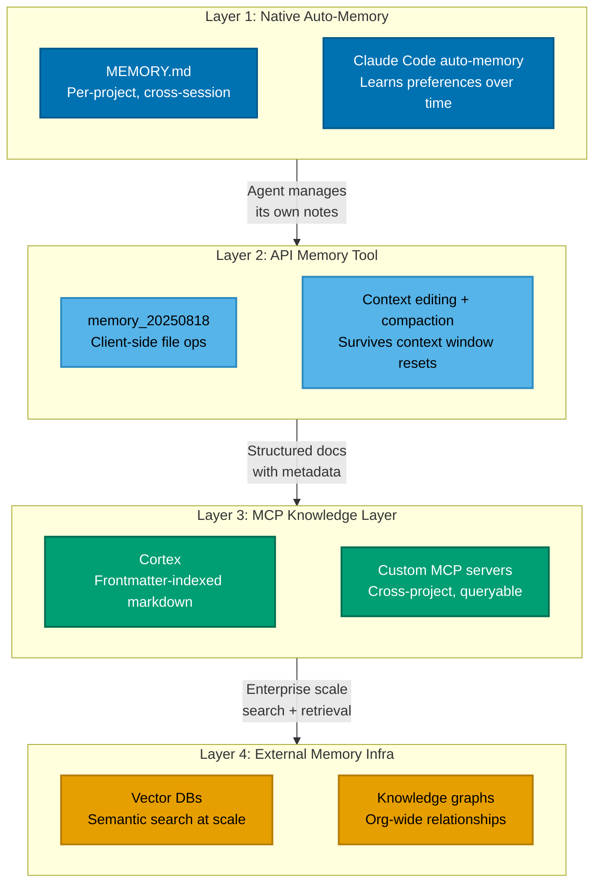

## Flowchart

```mermaid
flowchart TD
    subgraph L1["Layer 1: Native Auto-Memory"]
        M1["MEMORY.md<br/>Per-project, cross-session"]
        M2["Claude Code auto-memory<br/>Learns preferences over time"]
    end

    subgraph L2["Layer 2: API Memory Tool"]
        M3["memory_20250818<br/>Client-side file ops"]
        M4["Context editing + compaction<br/>Survives context window resets"]
    end

    subgraph L3["Layer 3: MCP Knowledge Layer"]
        M5["Cortex<br/>Frontmatter-indexed markdown"]
        M6["Custom MCP servers<br/>Cross-project, queryable"]
    end

    subgraph L4["Layer 4: External Memory Infra"]
        M7["Vector DBs<br/>Semantic search at scale"]
        M8["Knowledge graphs<br/>Org-wide relationships"]
    end

    L1 -->|"Agent manages<br/>its own notes"| L2
    L2 -->|"Structured docs<br/>with metadata"| L3
    L3 -->|"Enterprise scale<br/>search + retrieval"| L4

    M1 ~~~ M2
    M3 ~~~ M4
    M5 ~~~ M6
    M7 ~~~ M8

classDef primary fill:#0072B2,stroke:#005a8c,color:#fff,stroke-width:2px
classDef info fill:#56B4E9,stroke:#2A8ABF,color:#000,stroke-width:2px
classDef success fill:#009E73,stroke:#006B4F,color:#fff,stroke-width:2px
classDef warning fill:#E69F00,stroke:#B37A00,color:#000,stroke-width:2px
classDef danger fill:#D55E00,stroke:#A34800,color:#fff,stroke-width:2px
classDef highlight fill:#F0E442,stroke:#8A8200,color:#000,stroke-width:3px
classDef accent fill:#CC79A7,stroke:#A35E85,color:#000,stroke-width:2px

class M1,M2 primary
class M3,M4 info
class M5,M6 success
class M7,M8 warning
```

**Export:** Classic theme, A4 landscape.
